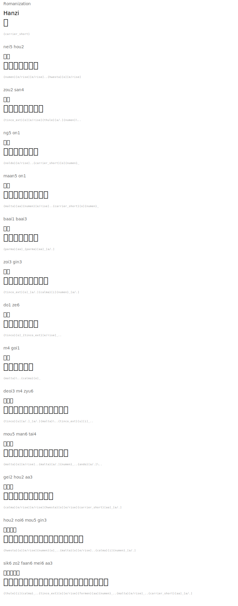

# Common Greetings

| Romanization | Hanzi | English | Tengwar | Names |
|---|---|---|---|---|
| nei5 hou2 | 你好 |  |  | `{numen}[e/rise][e/rise]..{hwesta}[o][e/rise]` |
| zou2 san4 | 早晨 |  |  | `{tinco_ext}[o][e/rise]{thule}[a/.]{numen}\..` |
| ng5 on1 | 午安 |  |  | `{noldo}[e/rise]..{carrier_short}[o]{numen}_` |
| maan5 on1 | 晚安 |  |  | `{malta}[aa]{numen}[e/rise]..{carrier_short}[o]{numen}_` |
| baai1 baai3 | 拜拜 |  |  | `{parma}[aa]_{parma}[aa]_[a/.]` |
| zoi3 gin3 | 再見 |  |  | `{tinco_ext}[o]_[a/.]{calma}[i]{numen}_[a/.]` |
| do1 ze6 | 多謝 |  |  | `{tinco}[o]_{tinco_ext}[e/rise]_..` |
| m4 goi1 | 唔該 |  |  | `{malta}\..{calma}[o]_` |
| deoi3 m4 zyu6 | 對唔住 |  |  | `{tinco}[u][a/.]_[a/.]{malta}\..{tinco_ext}[u][i]_..` |
| mou5 man6 tai4 | 冇問題 |  |  | `{malta}[o][e/rise]..{malta}[a/.]{numen}_..{ando}[a/.]\..` |
| gei2 hou2 aa3 | 幾好呀 |  |  | `{calma}[e/rise][e/rise]{hwesta}[o][e/rise]{carrier_short}[aa]_[a/.]` |
| hou2 noi6 mou5 gin3 | 好耐冇見 |  |  | `{hwesta}[o][e/rise]{numen}[o]_..{malta}[o][e/rise]..{calma}[i]{numen}_[a/.]` |
| sik6 zo2 faan6 mei6 aa3 | 食咗飯未呀 |  |  | `{thule}[i]{calma}_..{tinco_ext}[o][e/rise]{formen}[aa]{numen}_..{malta}[e/rise]_..{carrier_short}[aa]_[a/.]` |

## Rendered

