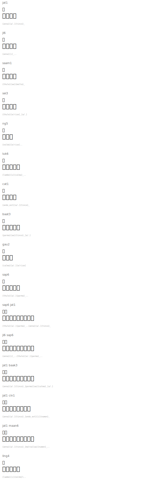

# Numbers 1-10

| Jyutping | 粵字 | Tengwar | Romanized Names |
|----------|------|---------|-----------------|
| jat1 | 一 |  | `{anna}[a/.]{tinco}_` |
| ji6 | 二 |  | `{anna}[i]_..` |
| saam1 | 三 |  | `{thule}[aa]{malta}_` |
| sei3 | 四 |  | `{thule}[e/rise]_[a/.]` |
| ng5 | 五 |  | `{noldo}[e/rise]..` |
| luk6 | 六 |  | `{lambe}[u]{calma}_..` |
| cat1 | 七 |  | `{ando_ext}[a/.]{tinco}_` |
| baat3 | 八 |  | `{parma}[aa]{tinco}_[a/.]` |
| gau2 | 九 |  | `{calma}[a/.][e/rise]` |
| sap6 | 十 |  | `{thule}[a/.]{parma}_..` |

## Extended Numbers

| Jyutping | 粵字 | Tengwar | Romanized Names |
|----------|------|---------|-----------------|
| sap6 jat1 | 十一 |  | `{thule}[a/.]{parma}_..{anna}[a/.]{tinco}_` |
| ji6 sap6 | 二十 |  | `{anna}[i]_..{thule}[a/.]{parma}_..` |
| jat1 baak3 | 一百 |  | `{anna}[a/.]{tinco}_{parma}[aa]{calma}_[a/.]` |
| jat1 cin1 | 一千 |  | `{anna}[a/.]{tinco}_{ando_ext}[i]{numen}_` |
| jat1 maan6 | 一萬 |  | `{anna}[a/.]{tinco}_{malta}[aa]{numen}_..` |
| ling4 | 零 |  | `{lambe}[i]{noldo}\..` |

## Rendered

