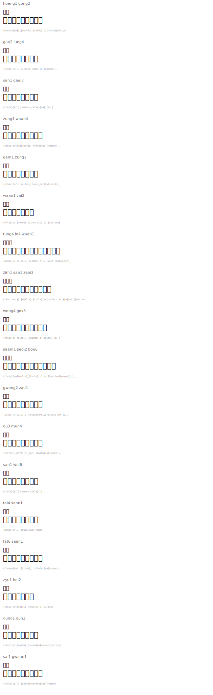

# Hong Kong Place Names

| Jyutping | 粵字 | Tengwar | Romanized Names |
|----------|------|---------|-----------------|
| hoeng1 gong2 | 香港 |  | `{hwesta}[o][i]{noldo}_{calma}[o]{noldo}[e/rise]` |
| gau2 lung4 | 九龍 |  | `{calma}[a/.][e/rise]{lambe}[u]{noldo}\..` |
| san1 gaai3 | 新界 |  | `{thule}[a/.]{numen}_{calma}[aa]_[a/.]` |
| zung1 waan4 | 中環 |  | `{tinco_ext}[u]{noldo}_{vala}[aa]{numen}\..` |
| gam1 zung1 | 金鐘 |  | `{calma}[a/.]{malta}_{tinco_ext}[u]{noldo}_` |
| waan1 zai2 | 灣仔 |  | `{vala}[aa]{numen}_{tinco_ext}[a/.][e/rise]` |
| tung4 lo4 waan1 | 銅鑼灣 |  | `{ando}[u]{noldo}\..{lambe}[o]\..{vala}[aa]{numen}_` |
| zim1 saa1 zeoi2 | 尖沙咀 |  | `{tinco_ext}[i]{malta}_{thule}[aa]_{tinco_ext}[u][a/.][e/rise]` |
| wong4 gok3 | 旺角 |  | `{vala}[o]{noldo}\..{calma}[o]{calma}_[a/.]` |
| saam1 seoi2 bou6 | 深水埗 |  | `{thule}[aa]{malta}_{thule}[u][a/.][e/rise]{parma}[o]_..` |

## Greater Canton Region

| Jyutping | 粵字 | Tengwar | Romanized Names |
|----------|------|---------|-----------------|
| gwong2 zau1 | 廣州 |  | `{calma}+w{vala}[o]{noldo}[e/rise]{tinco_ext}[a/.]_` |
| ou3 mun4 | 澳門 |  | `{carrier_short}[o]_[a/.]{malta}[u]{numen}\..` |
| san1 wui6 | 新會 |  | `{thule}[a/.]{numen}_{vala}[u]_..` |
| toi4 saan1 | 台山 |  | `{ando}[o]\..{thule}[aa]{numen}_` |
| fat6 saan1 | 佛山 |  | `{formen}[a/.]{tinco}_..{thule}[aa]{numen}_` |
| zyu1 hoi2 | 珠海 |  | `{tinco_ext}[u][i]_{hwesta}[o][e/rise]` |
| dung1 gun2 | 東莞 |  | `{tinco}[u]{noldo}_{calma}[u]{numen}[e/rise]` |
| sai1 gwaan1 | 西關 |  | `{thule}[a/.]_{calma}+w{vala}[aa]{numen}_` |

## Rendered

