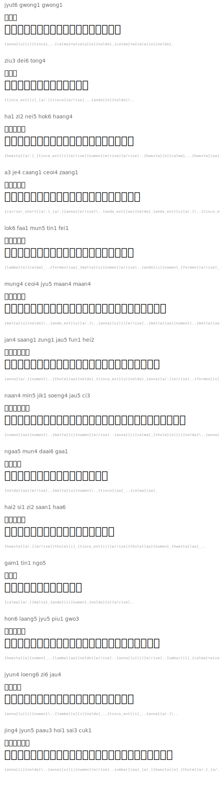

# Cantonese Poetry and Songs

## 月光光 (Moonlight Bright)

Traditional Cantonese nursery rhyme.

| Romanization | Hanzi | English | Tengwar | Names |
|---|---|---|---|---|
| jyut6 gwong1 gwong1 | 月光光 |  |  | `{anna}[u][i]{tinco}_..{calma}+w{vala}[o]{noldo}_{calma}+w{vala}[o]{noldo}_` |
| ziu3 dei6 tong4 | 照地堂 |  |  | `{tinco_ext}[i]_[a/.]{tinco}[e/rise]_..{ando}[o]{noldo}\..` |
| ha1 zi2 nei5 hok6 haang4 | 蝦仔你學行 |  |  | `{hwesta}[a/.]_{tinco_ext}[i][e/rise]{numen}[e/rise][e/rise]..{hwesta}[o]{calma}_..{hwesta}[aa]{noldo}\..` |
| a3 je4 caang1 ceoi4 zaang1 | 阿爺撐船撐 |  |  | `{carrier_short}[a/.]_[a/.]{anna}[e/rise]\..{ando_ext}[aa]{noldo}_{ando_ext}[u][a/.]\..{tinco_ext}[aa]{noldo}_` |

### Translation

*Moonlight bright, bright*
*Shines on the hall floor*
*Little shrimp, you learn to walk*
*Grandpa poles the boat*

---

## 帝女花 (Princess Changping)

From the famous Cantonese opera, lyrics by Tong Dik-sang.

| Romanization | Hanzi | English |  | Tengwar | Names |
|---|---|---|---|---|
| lok6 faa1 mun5 tin1 fei1 | 落花滿天飛 |  |  | `{lambe}[o]{calma}_..{formen}[aa]_{malta}[u]{numen}[e/rise]..{ando}[i]{numen}_{formen}[e/rise]_` |
| mung4 ceoi4 jyu5 maan4 maan4 | 夢隨雨漫漫 |  |  | `{malta}[u]{noldo}\..{ando_ext}[u][a/.]\..{anna}[u][i][e/rise]..{malta}[aa]{numen}\..{malta}[aa]{numen}\..` |

### Translation

*Falling petals fill the sky*
*Dreams drift with the endless rain*

---

## 獅子山下 (Below Lion Rock)

Theme song of the classic Hong Kong TV series (1979), lyrics by James Wong Jim.

| Romanization | Hanzi | English |  | Tengwar | Names |
|---|---|---|---|---|
| jan4 saang1 zung1 jau5 fun1 hei2 | 人生中有歡喜 |  |  | `{anna}[a/.]{numen}\..{thule}[aa]{noldo}_{tinco_ext}[u]{noldo}_{anna}[a/.][e/rise]..{formen}[u]{numen}_{hwesta}[e/rise][e/rise]` |
| naan4 min5 jik1 soeng4 jau5 ci3 | 難免亦常有淚 |  |  | `{numen}[aa]{numen}\..{malta}[i]{numen}[e/rise]..{anna}[i]{calma}_{thule}[o][i]{noldo}\..{anna}[a/.][e/rise]..{ando_ext}[i]_[a/.]` |
| ngaa5 mun4 daai6 gaa1 | 我哋大家 |  |  | `{noldo}[aa][e/rise]..{malta}[u]{numen}\..{tinco}[aa]_..{calma}[aa]_` |
| hai2 si1 zi2 saan1 haa6 | 喺獅子山下 |  |  | `{hwesta}[a/.][e/rise]{thule}[i]_{tinco_ext}[i][e/rise]{thule}[aa]{numen}_{hwesta}[aa]_..` |

### Translation

*In life there is joy*
*Inevitably there are often tears*
*All of us together*
*Meet below Lion Rock*

---

## 海闊天空 (Boundless Oceans, Vast Skies)

Beyond (band), 1993. One of the most beloved Cantonese rock songs.

| Romanization | Hanzi | English |  | Tengwar | Names |
|---|---|---|---|---|
| gam1 tin1 ngo5 | 今天我 |  |  | `{calma}[a/.]{malta}_{ando}[i]{numen}_{noldo}[o][e/rise]..` |
| hon6 laang5 jyu5 piu1 gwo3 | 寒冷雨飄過 |  |  | `{hwesta}[o]{numen}_..{lambe}[aa]{noldo}[e/rise]..{anna}[u][i][e/rise]..{umbar}[i]_{calma}+w{vala}[o]_[a/.]` |
| jyun4 loeng6 zi6 jau4 | 原諒自由 |  |  | `{anna}[u][i]{numen}\..{lambe}[o][i]{noldo}_..{tinco_ext}[i]_..{anna}[a/.]\..` |
| jing4 jyun5 paau3 hoi1 sai3 cuk1 | 仍願拋開世俗 |  |  | `{anna}[i]{noldo}\..{anna}[u][i]{numen}[e/rise]..{umbar}[aa]_[a/.]{hwesta}[o]_{thule}[a/.]_[a/.]{ando_ext}[u]{calma}_` |

### Translation

*Today I*
*Cold rain drifts by*
*Forgive freedom*
*Still willing to cast off worldly conventions*

## Rendered

