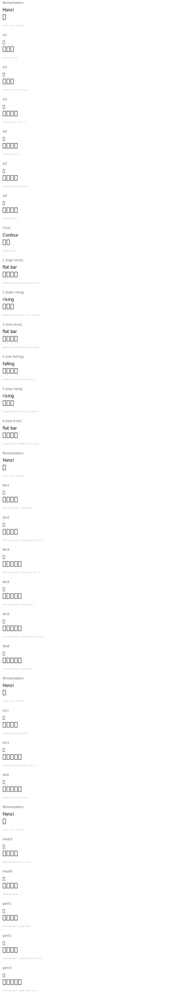

# Tone Demonstration

Cantonese has 6 lexical tones. The Tengwar mode marks them with contour shapes and register modifiers.

## The Classic 詩 (si) Set - All 6 Tones

| Romanization | Hanzi | English | Tengwar | Names |
|---|---|---|---|---|
| si1 | 詩 | poem |  | `{thule}[i]_` |
| si2 | 史 | history |  | `{thule}[i][e/rise]` |
| si3 | 試 | try |  | `{thule}[i]_[a/.]` |
| si4 | 時 | time |  | `{thule}[i]\..` |
| si5 | 市 | market |  | `{thule}[i][e/rise]..` |
| si6 | 事 | matter |  | `{thule}[i]_..` |

## Tone Mark Explanation

| Tone | Contour | Register |  |  |
|---|---|---|---|---|
| 1 (high level) | flat bar | high |  |  |
| 2 (high rising) | rising | high |  |  |
| 3 (mid level) | flat bar | mid |  |  |
| 4 (low falling) | falling | low |  |  |
| 5 (low rising) | rising | low |  |  |
| 6 (low level) | flat bar | low |  |  |

## The 分 (fan) Set

| Romanization | Hanzi | English | Tengwar | Names |  |
|---|---|---|---|---|
| fan1 | 分 | divide | `{formen}[a/.]{numen}_` |  |
| fan2 | 粉 | powder | `{formen}[a/.]{numen}[e/rise]` |  |
| fan3 | 訓 | teach | `{formen}[a/.]{numen}_[a/.]` |  |
| fan4 | 焚 | burn | `{formen}[a/.]{numen}\..` |  |
| fan5 | 憤 | angry | `{formen}[a/.]{numen}[e/rise]..` |  |
| fan6 | 份 | portion | `{formen}[a/.]{numen}_..` |  |

## Checked (Entering) Tones

Short syllables ending in -p, -t, -k inherit tone contours from tones 1, 3, 6.

| Romanization | Hanzi | English | Tengwar | Names |
|---|---|---|---|---|
| sik1 | 色 | color |  | `{thule}[i]{calma}_` |
| sik3 | 識 | know |  | `{thule}[i]{calma}_[a/.]` |
| sik6 | 食 | eat |  | `{thule}[i]{calma}_..` |

## Minimal Tone Pairs

| Romanization | Hanzi | English | Tengwar | Names |  |
|---|---|---|---|---|
| maai5 | 買 | buy | `{malta}[aa][e/rise]..` |  |
| maai6 | 賣 | sell | `{malta}[aa]_..` |  |
| gam1 | 金 | gold | `{calma}[a/.]{malta}_` |  |
| gam2 | 咁 | so (adverb) | `{calma}[a/.]{malta}[e/rise]` |  |
| gam3 | 禁 | prohibit | `{calma}[a/.]{malta}_[a/.]` |  |

## Rendered

