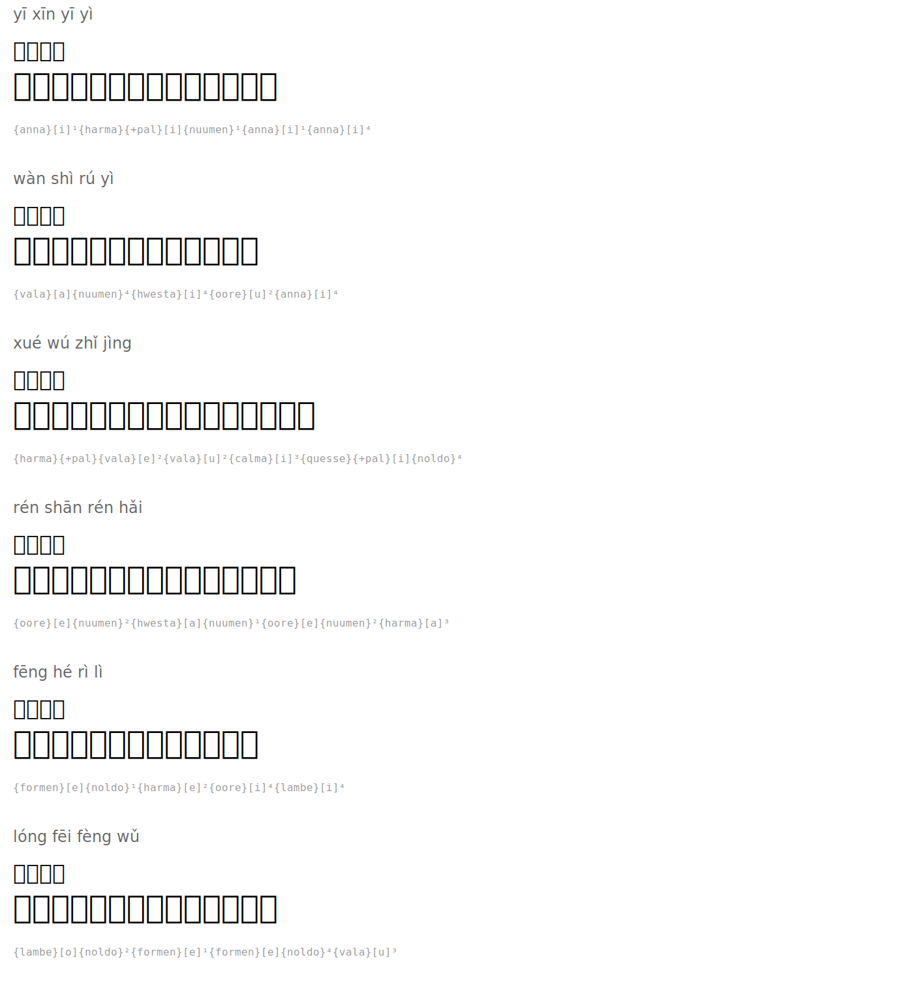

# Four-Character Idioms (Chengyu)

| Pinyin | 汉字 | English | Tengwar | Romanized |
|--------|------|---------|---------|-----------|
| yī xīn yī yì | 一心一意 | wholeheartedly |  | `{anna}[i]¹{hwesta}{+pal}[i]{nuumen}¹{anna}[i]¹{anna}[i]⁴` |
| wàn shì rú yì | 万事如意 | may all go as you wish |  | `{vala}[a]{nuumen}⁴{harma}[i]⁴{oore}[u]²{anna}[i]⁴` |
| xué wú zhǐ jìng | 学无止境 | learning has no limits |  | `{hwesta}{+pal}{vala}[e]²{vala}[u]²{quesse}[i]³{calma}{+pal}[i]{noldo}⁴` |
| rén shān rén hǎi | 人山人海 | huge crowds |  | `{oore}[e]{nuumen}²{harma}[a]{nuumen}¹{oore}[e]{nuumen}²{hwesta}[a]³` |
| fēng hé rì lì | 风和日丽 | gentle breeze, beautiful day |  | `{formen}[e]{noldo}¹{hwesta}[e]²{oore}[i]⁴{lambe}[i]⁴` |
| lóng fēi fèng wǔ | 龙飞凤舞 | lively and vigorous (calligraphy) |  | `{lambe}[o]{noldo}²{formen}[e]¹{formen}[e]{noldo}⁴{vala}[u]³` |

## Rendered

