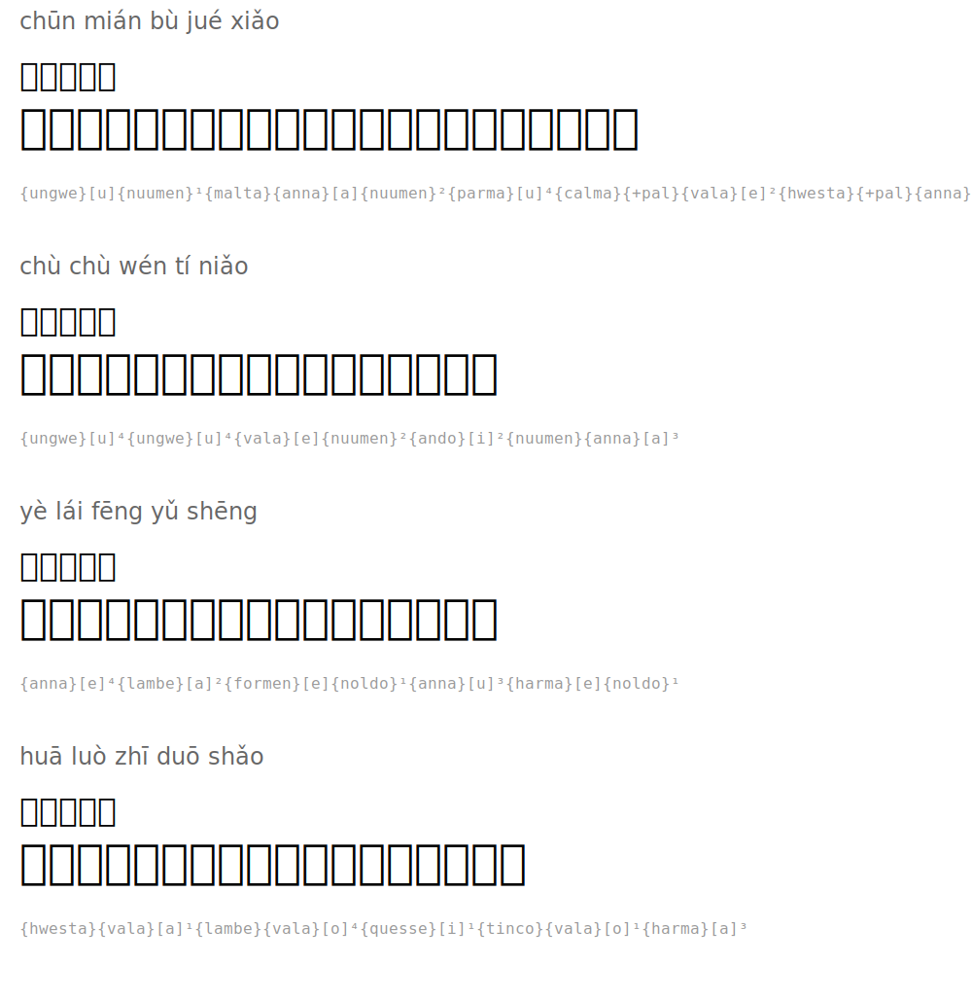

# 春晓 — Spring Dawn

**Author:** 孟浩然 (Meng Haoran, 689-740)

| Pinyin | 汉字 | Tengwar | Romanized |
|--------|------|---------|-----------|
| chūn mián bù jué xiǎo | 春眠不觉晓 |  | `{anga}[u]{nuumen}¹{malta}{anna}[a]{nuumen}²{parma}[u]⁴{quesse}{+pal}{vala}[e]²{harma}{+pal}{anna}[a]³` |
| chù chù wén tí niǎo | 处处闻啼鸟 |  | `{anga}[u]⁴{anga}[u]⁴{vala}[e]{nuumen}²{ando}[i]²{nuumen}{anna}[a]³` |
| yè lái fēng yǔ shēng | 夜来风雨声 |  | `{anna}[e]⁴{lambe}[a]²{formen}[e]{noldo}¹{anna}[u]³{hwesta}[e]{noldo}¹` |
| huā luò zhī duō shǎo | 花落知多少 |  | `{harma}{vala}[a]¹{lambe}{vala}[o]⁴{calma}[i]¹{tinco}{vala}[o]¹{hwesta}[a]³` |

## Translation

*Spring slumber, unaware of dawn*
*Everywhere, I hear birds singing*
*Last night came sounds of wind and rain*
*How many blossoms have fallen?*

## Rendered

