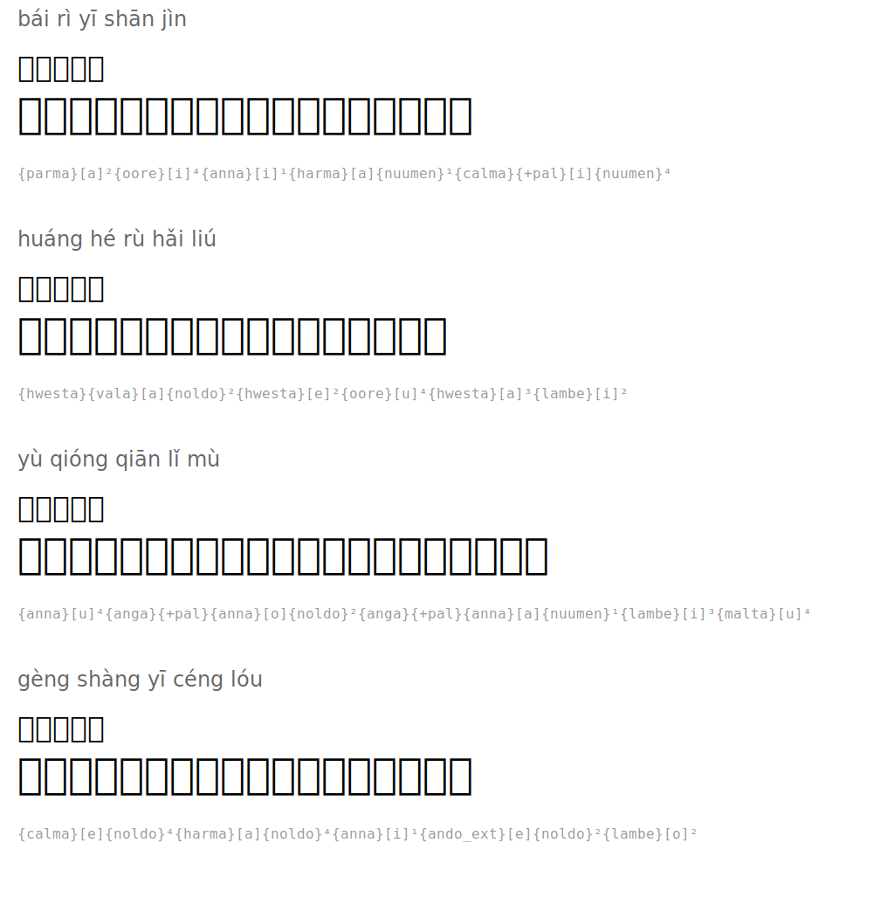

# 登鹳雀楼 — Climbing Stork Tower

**Author:** 王之涣 (Wang Zhihuan, 688-742)

| Pinyin | 汉字 | Tengwar | Romanized |
|--------|------|---------|-----------|
| bái rì yī shān jìn | 白日依山尽 |  | `{parma}[a]²{oore}[i]⁴{anna}[i]¹{hwesta}[a]{nuumen}¹{quesse}{+pal}[i]{nuumen}⁴` |
| huáng hé rù hǎi liú | 黄河入海流 |  | `{harma}{vala}[a]{noldo}²{harma}[e]²{oore}[u]⁴{harma}[a]³{lambe}[i]²` |
| yù qióng qiān lǐ mù | 欲穷千里目 |  | `{anna}[u]⁴{ungwe}{+pal}{anna}[o]{noldo}²{ungwe}{+pal}{anna}[a]{nuumen}¹{lambe}[i]³{malta}[u]⁴` |
| gèng shàng yī céng lóu | 更上一层楼 |  | `{quesse}[e]{noldo}⁴{hwesta}[a]{noldo}⁴{anna}[i]¹{ando_ext}[e]{noldo}²{lambe}[o]²` |

## Translation

*The white sun sets behind the mountains*
*The Yellow River flows into the sea*
*To see a thousand miles further*
*Climb one more floor*

## Rendered

