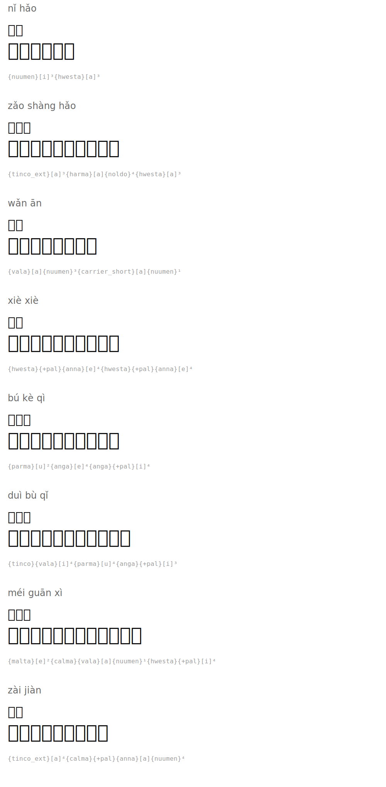

# Common Greetings

| Romanization | Hanzi | English | Tengwar | Names |
|--------|------|---------|---------|-----------|
| nǐ hǎo | 你好 | Hello |  | `{nuumen}[i]³{harma}[a]³` |
| zǎo shàng hǎo | 早上好 | Good morning |  | `{tinco_ext}[a]³{hwesta}[a]{noldo}⁴{harma}[a]³` |
| wǎn ān | 晚安 | Good night |  | `{vala}[a]{nuumen}³{carrier_short}[a]{nuumen}¹` |
| xiè xiè | 谢谢 | Thank you |  | `{harma}{+pal}{anna}[e]⁴{harma}{+pal}{anna}[e]⁴` |
| bú kè qì | 不客气 | You're welcome |  | `{parma}[u]²{ungwe}[e]⁴{ungwe}{+pal}[i]⁴` |
| duì bù qǐ | 对不起 | Sorry |  | `{tinco}{vala}[i]⁴{parma}[u]⁴{ungwe}{+pal}[i]³` |
| méi guān xì | 没关系 | It's okay |  | `{malta}[e]²{quesse}{vala}[a]{nuumen}¹{harma}{+pal}[i]⁴` |
| zài jiàn | 再见 | Goodbye |  | `{tinco_ext}[a]⁴{quesse}{+pal}{anna}[a]{nuumen}⁴` |

## Rendered

