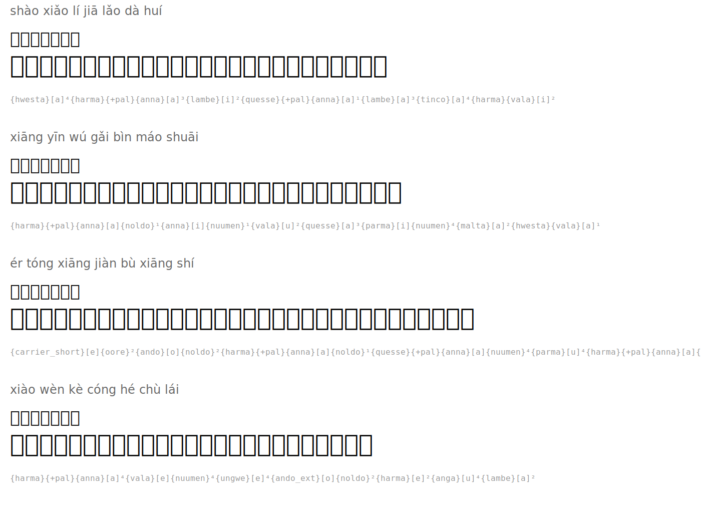

# 回乡偶书 — Returning Home

**Author:** 贺知章 (He Zhizhang, 659-744)

| Romanization | Hanzi | Tengwar | Names |
|--------|------|---------|-----------|
| shào xiǎo lí jiā lǎo dà huí | 少小离家老大回 |  | `{hwesta}[a]⁴{harma}{+pal}{anna}[a]³{lambe}[i]²{quesse}{+pal}{anna}[a]¹{lambe}[a]³{tinco}[a]⁴{harma}{vala}[i]²` |
| xiāng yīn wú gǎi bìn máo shuāi | 乡音无改鬓毛衰 |  | `{harma}{+pal}{anna}[a]{noldo}¹{anna}[i]{nuumen}¹{vala}[u]²{quesse}[a]³{parma}[i]{nuumen}⁴{malta}[a]²{hwesta}{vala}[a]¹` |
| ér tóng xiāng jiàn bù xiāng shí | 儿童相见不相识 |  | `{carrier_short}[e]{oore}²{ando}[o]{noldo}²{harma}{+pal}{anna}[a]{noldo}¹{quesse}{+pal}{anna}[a]{nuumen}⁴{parma}[u]⁴{harma}{+pal}{anna}[a]{noldo}¹{hwesta}[i]²` |
| xiào wèn kè cóng hé chù lái | 笑问客从何处来 |  | `{harma}{+pal}{anna}[a]⁴{vala}[e]{nuumen}⁴{ungwe}[e]⁴{ando_ext}[o]{noldo}²{harma}[e]²{anga}[u]⁴{lambe}[a]²` |

## Translation

*I left home young and return old*
*My accent unchanged, but my temples gray*
*Children see me but do not know me*
*Smiling, they ask: where does this stranger come from?*

## Rendered

