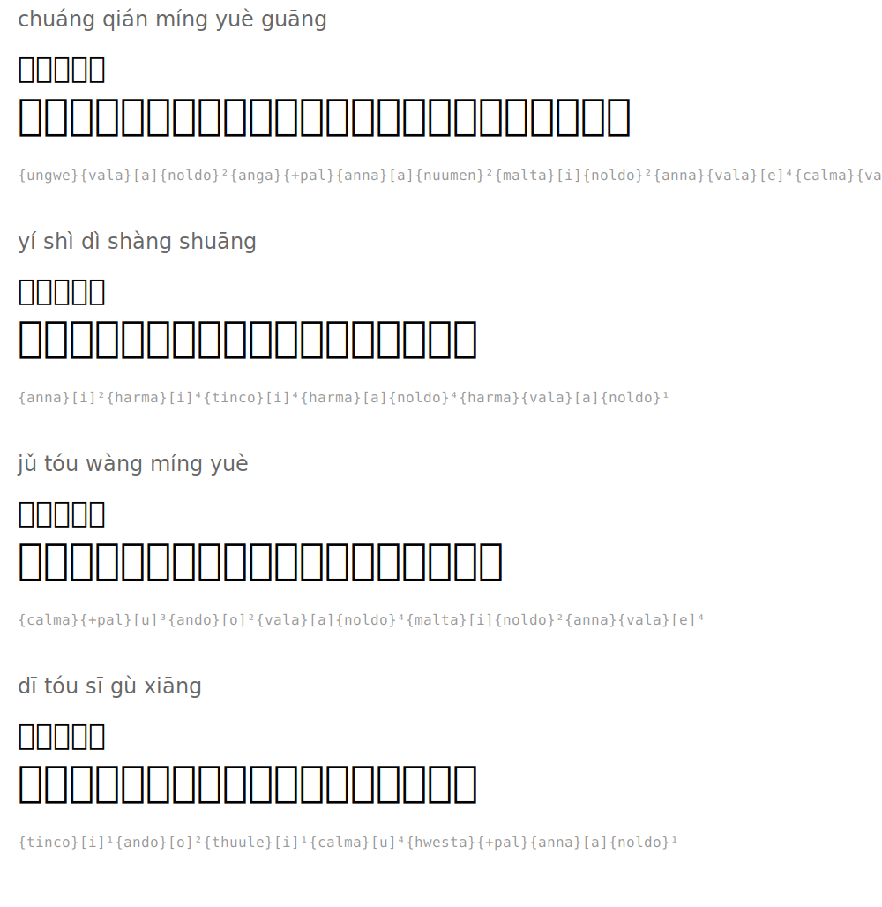

# 静夜思 — Quiet Night Thought

**Author:** 李白 (Li Bai, 701-762)

| Pinyin | 汉字 | Tengwar | Romanized |
|--------|------|---------|-----------|
| chuáng qián míng yuè guāng | 床前明月光 |  | `{anga}{vala}[a]{noldo}²{ungwe}{+pal}{anna}[a]{nuumen}²{malta}[i]{noldo}²{anna}{vala}[e]⁴{quesse}{vala}[a]{noldo}¹` |
| yí shì dì shàng shuāng | 疑是地上霜 |  | `{anna}[i]²{hwesta}[i]⁴{tinco}[i]⁴{hwesta}[a]{noldo}⁴{hwesta}{vala}[a]{noldo}¹` |
| jǔ tóu wàng míng yuè | 举头望明月 |  | `{quesse}{+pal}[u]³{ando}[o]²{vala}[a]{noldo}⁴{malta}[i]{noldo}²{anna}{vala}[e]⁴` |
| dī tóu sī gù xiāng | 低头思故乡 |  | `{tinco}[i]¹{ando}[o]²{thuule}[i]¹{quesse}[u]⁴{harma}{+pal}{anna}[a]{noldo}¹` |

## Translation

*Before my bed, bright moonlight*
*I thought it was frost on the ground*
*Raising my head, I gaze at the bright moon*
*Lowering my head, I think of my homeland*

## Rendered

