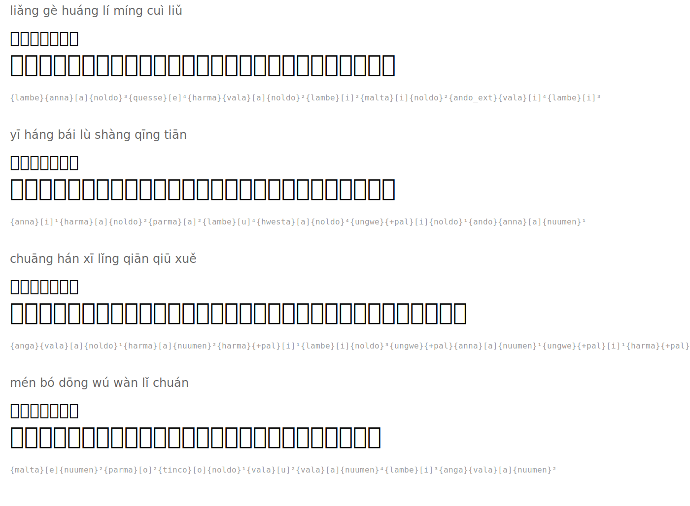

# 绝句 — Quatrain

**Author:** 杜甫 (Du Fu, 712-770)

| Romanization | Hanzi | Tengwar | Names |
|--------|------|---------|-----------|
| liǎng gè huáng lí míng cuì liǔ | 两个黄鹂鸣翠柳 |  | `{lambe}{anna}[a]{noldo}³{quesse}[e]⁴{harma}{vala}[a]{noldo}²{lambe}[i]²{malta}[i]{noldo}²{ando_ext}{vala}[i]⁴{lambe}[i]³` |
| yī háng bái lù shàng qīng tiān | 一行白鹭上青天 |  | `{anna}[i]¹{harma}[a]{noldo}²{parma}[a]²{lambe}[u]⁴{hwesta}[a]{noldo}⁴{ungwe}{+pal}[i]{noldo}¹{ando}{anna}[a]{nuumen}¹` |
| chuāng hán xī lǐng qiān qiū xuě | 窗含西岭千秋雪 |  | `{anga}{vala}[a]{noldo}¹{harma}[a]{nuumen}²{harma}{+pal}[i]¹{lambe}[i]{noldo}³{ungwe}{+pal}{anna}[a]{nuumen}¹{ungwe}{+pal}[i]¹{harma}{+pal}{vala}[e]³` |
| mén bó dōng wú wàn lǐ chuán | 门泊东吴万里船 |  | `{malta}[e]{nuumen}²{parma}[o]²{tinco}[o]{noldo}¹{vala}[u]²{vala}[a]{nuumen}⁴{lambe}[i]³{anga}{vala}[a]{nuumen}²` |

## Translation

*Two golden orioles sing in the emerald willows*
*A line of white egrets rises to the blue sky*
*My window frames the western peaks' eternal snow*
*At my door, boats bound for distant Wu are moored*

## Rendered

