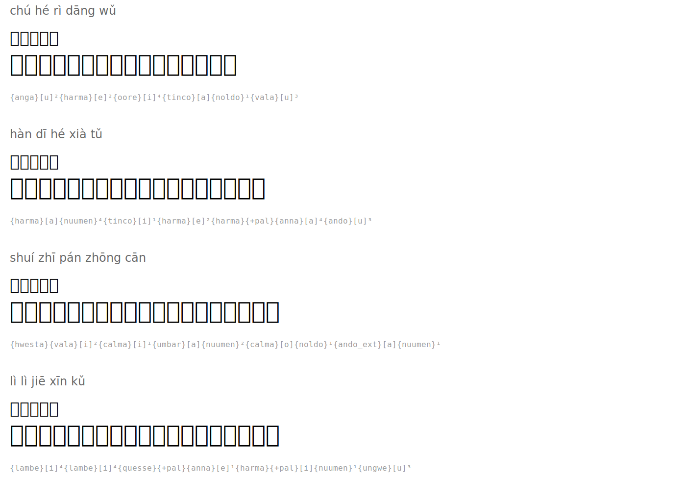

# 悯农 — Pitying the Farmers

**Author:** 李绅 (Li Shen, 772-846)

| Pinyin | 汉字 | Tengwar | Romanized |
|--------|------|---------|-----------|
| chú hé rì dāng wǔ | 锄禾日当午 |  | `{anga}[u]²{harma}[e]²{oore}[i]⁴{tinco}[a]{noldo}¹{vala}[u]³` |
| hàn dī hé xià tǔ | 汗滴禾下土 |  | `{harma}[a]{nuumen}⁴{tinco}[i]¹{harma}[e]²{harma}{+pal}{anna}[a]⁴{ando}[u]³` |
| shuí zhī pán zhōng cān | 谁知盘中餐 |  | `{hwesta}{vala}[i]²{calma}[i]¹{umbar}[a]{nuumen}²{calma}[o]{noldo}¹{ando_ext}[a]{nuumen}¹` |
| lì lì jiē xīn kǔ | 粒粒皆辛苦 |  | `{lambe}[i]⁴{lambe}[i]⁴{quesse}{+pal}{anna}[e]¹{harma}{+pal}[i]{nuumen}¹{ungwe}[u]³` |

## Translation

*Hoeing grain under the midday sun*
*Sweat drips onto the soil beneath*
*Who knows that the meal in the bowl*
*Every grain comes from bitter toil*

## Rendered

