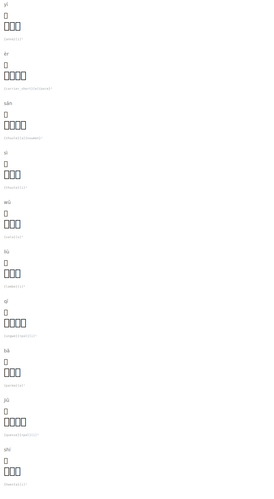

# Numbers 1-10

| Romanization | Hanzi | English | Tengwar | Names |
|--------|------|---------|---------|-----------|
| yī | 一 | one |  | `{anna}[i]¹` |
| èr | 二 | two |  | `{carrier_short}[e]{oore}⁴` |
| sān | 三 | three |  | `{thuule}[a]{nuumen}¹` |
| sì | 四 | four |  | `{thuule}[i]⁴` |
| wǔ | 五 | five |  | `{vala}[u]³` |
| liù | 六 | six |  | `{lambe}[i]⁴` |
| qī | 七 | seven |  | `{ungwe}{+pal}[i]¹` |
| bā | 八 | eight |  | `{parma}[a]¹` |
| jiǔ | 九 | nine |  | `{quesse}{+pal}[i]³` |
| shí | 十 | ten |  | `{hwesta}[i]²` |

## Rendered

