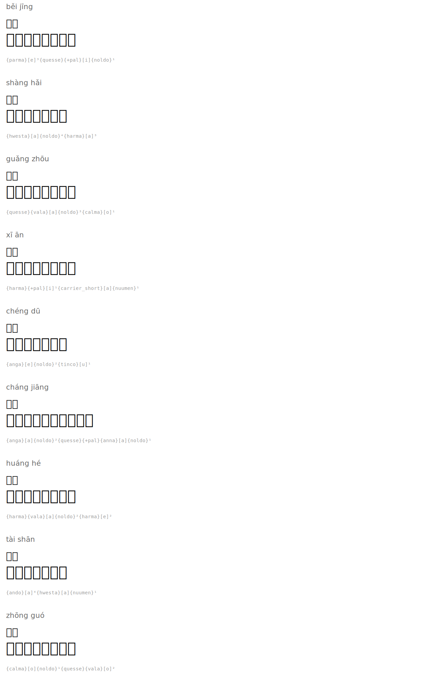

# Place Names

| Romanization | Hanzi | English | Tengwar | Names |
|--------|------|---------|---------|-----------|
| běi jīng | 北京 | Beijing |  | `{parma}[e]³{quesse}{+pal}[i]{noldo}¹` |
| shàng hǎi | 上海 | Shanghai |  | `{hwesta}[a]{noldo}⁴{harma}[a]³` |
| guǎng zhōu | 广州 | Guangzhou |  | `{quesse}{vala}[a]{noldo}³{calma}[o]¹` |
| xī ān | 西安 | Xi'an |  | `{harma}{+pal}[i]¹{carrier_short}[a]{nuumen}¹` |
| chéng dū | 成都 | Chengdu |  | `{anga}[e]{noldo}²{tinco}[u]¹` |
| cháng jiāng | 长江 | Yangtze River |  | `{anga}[a]{noldo}²{quesse}{+pal}{anna}[a]{noldo}¹` |
| huáng hé | 黄河 | Yellow River |  | `{harma}{vala}[a]{noldo}²{harma}[e]²` |
| tài shān | 泰山 | Mount Tai |  | `{ando}[a]⁴{hwesta}[a]{nuumen}¹` |
| zhōng guó | 中国 | China |  | `{calma}[o]{noldo}¹{quesse}{vala}[o]²` |

## Rendered

