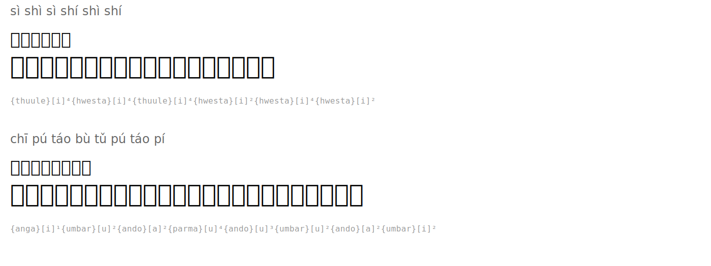

# Tongue Twisters

| Romanization | Hanzi | English | Tengwar | Names |
|--------|------|---------|---------|-----------|
| sì shì sì shí shì shí | 四是四十是十 | Four is four, ten is ten |  | `{thuule}[i]⁴{hwesta}[i]⁴{thuule}[i]⁴{hwesta}[i]²{hwesta}[i]⁴{hwesta}[i]²` |
| chī pú táo bù tǔ pú táo pí | 吃葡萄不吐葡萄皮 | Eat grapes without spitting grape skins |  | `{anga}[i]¹{umbar}[u]²{ando}[a]²{parma}[u]⁴{ando}[u]³{umbar}[u]²{ando}[a]²{umbar}[i]²` |

## Rendered

