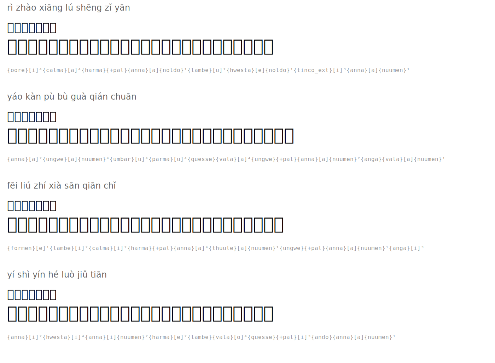

# 望庐山瀑布 — Viewing the Waterfall at Mount Lu

**Author:** 李白 (Li Bai, 701-762)

| Romanization | Hanzi | Tengwar | Names |
|--------|------|---------|-----------|
| rì zhào xiāng lú shēng zǐ yān | 日照香炉生紫烟 |  | `{oore}[i]⁴{calma}[a]⁴{harma}{+pal}{anna}[a]{noldo}¹{lambe}[u]²{hwesta}[e]{noldo}¹{tinco_ext}[i]³{anna}[a]{nuumen}¹` |
| yáo kàn pù bù guà qián chuān | 遥看瀑布挂前川 |  | `{anna}[a]²{ungwe}[a]{nuumen}⁴{umbar}[u]⁴{parma}[u]⁴{quesse}{vala}[a]⁴{ungwe}{+pal}{anna}[a]{nuumen}²{anga}{vala}[a]{nuumen}¹` |
| fēi liú zhí xià sān qiān chǐ | 飞流直下三千尺 |  | `{formen}[e]¹{lambe}[i]²{calma}[i]²{harma}{+pal}{anna}[a]⁴{thuule}[a]{nuumen}¹{ungwe}{+pal}{anna}[a]{nuumen}¹{anga}[i]³` |
| yí shì yín hé luò jiǔ tiān | 疑是银河落九天 |  | `{anna}[i]²{hwesta}[i]⁴{anna}[i]{nuumen}²{harma}[e]²{lambe}{vala}[o]⁴{quesse}{+pal}[i]³{ando}{anna}[a]{nuumen}¹` |

## Translation

*Sunlight on Incense Burner Peak creates purple mist*
*From afar I see the waterfall hang over the stream*
*Flying waters plunge straight down three thousand feet*
*I suspect the Milky Way has fallen from the heavens*

## Rendered

