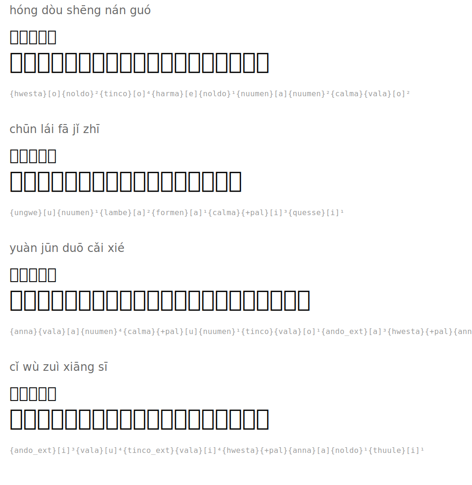

# 相思 — Longing

**Author:** 王维 (Wang Wei, 699-759)

| Pinyin | 汉字 | Tengwar | Romanized |
|--------|------|---------|-----------|
| hóng dòu shēng nán guó | 红豆生南国 |  | `{hwesta}[o]{noldo}²{tinco}[o]⁴{harma}[e]{noldo}¹{nuumen}[a]{nuumen}²{calma}{vala}[o]²` |
| chūn lái fā jǐ zhī | 春来发几枝 |  | `{ungwe}[u]{nuumen}¹{lambe}[a]²{formen}[a]¹{calma}{+pal}[i]³{quesse}[i]¹` |
| yuàn jūn duō cǎi xié | 愿君多采撷 |  | `{anna}{vala}[a]{nuumen}⁴{calma}{+pal}[u]{nuumen}¹{tinco}{vala}[o]¹{ando_ext}[a]³{hwesta}{+pal}{anna}[e]²` |
| cǐ wù zuì xiāng sī | 此物最相思 |  | `{ando_ext}[i]³{vala}[u]⁴{tinco_ext}{vala}[i]⁴{hwesta}{+pal}{anna}[a]{noldo}¹{thuule}[i]¹` |

## Translation

*Red beans grow in the southern lands*
*When spring comes, how many branches bloom?*
*I wish you would gather many*
*For this thing evokes the deepest longing*

## Rendered

