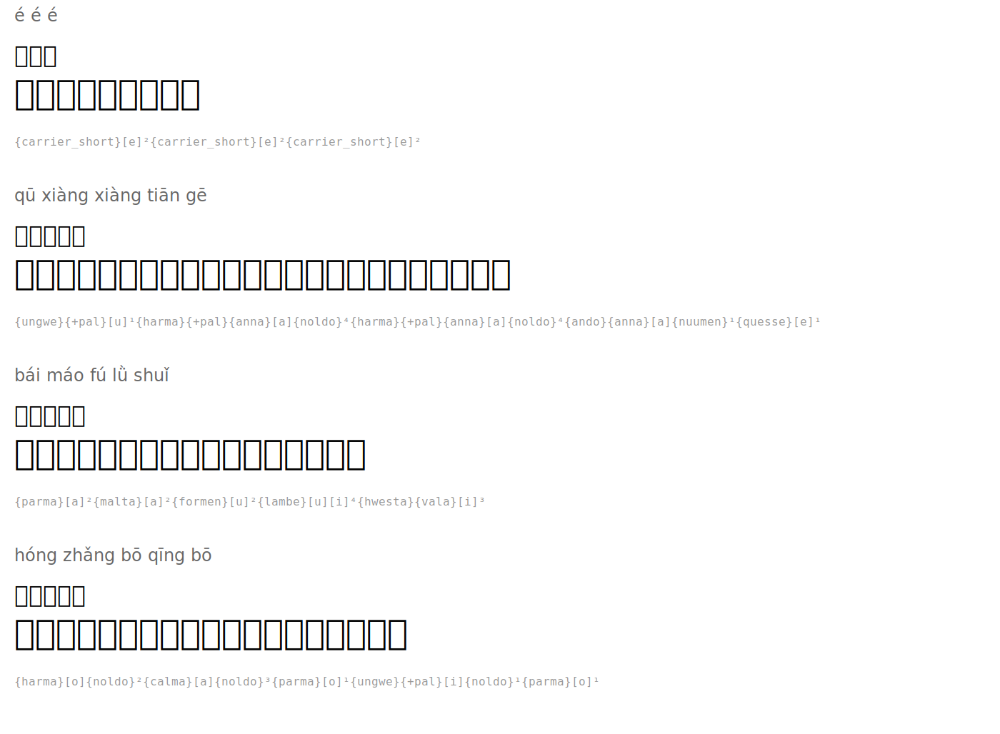

# 咏鹅 — Ode to the Goose

**Author:** 骆宾王 (Luo Binwang, 619-687)

| Pinyin | 汉字 | Tengwar | Romanized |
|--------|------|---------|-----------|
| é é é | 鹅鹅鹅 |  | `{carrier_short}[e]²{carrier_short}[e]²{carrier_short}[e]²` |
| qū xiàng xiàng tiān gē | 曲项向天歌 |  | `{ungwe}{+pal}[u]¹{harma}{+pal}{anna}[a]{noldo}⁴{harma}{+pal}{anna}[a]{noldo}⁴{ando}{anna}[a]{nuumen}¹{quesse}[e]¹` |
| bái máo fú lǜ shuǐ | 白毛浮绿水 |  | `{parma}[a]²{malta}[a]²{formen}[u]²{lambe}[u][i]⁴{hwesta}{vala}[i]³` |
| hóng zhǎng bō qīng bō | 红掌拨清波 |  | `{harma}[o]{noldo}²{calma}[a]{noldo}³{parma}[o]¹{ungwe}{+pal}[i]{noldo}¹{parma}[o]¹` |

## Translation

*Goose, goose, goose*
*Curved neck singing to the sky*
*White feathers floating on green water*
*Red feet paddling the clear waves*

## Rendered

