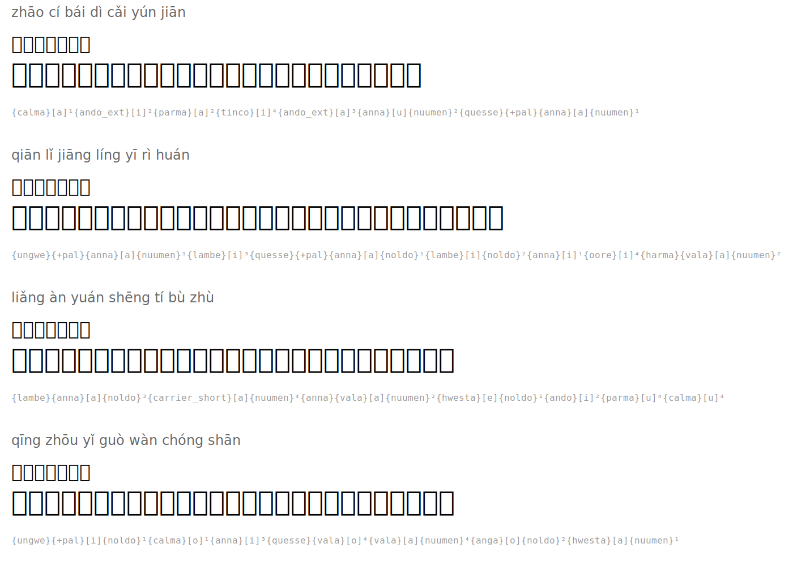

# 早发白帝城 — Leaving White Emperor City at Dawn

**Author:** 李白 (Li Bai, 701-762)

| Pinyin | 汉字 | Tengwar | Romanized |
|--------|------|---------|-----------|
| zhāo cí bái dì cǎi yún jiān | 朝辞白帝彩云间 |  | `{calma}[a]¹{ando_ext}[i]²{parma}[a]²{tinco}[i]⁴{ando_ext}[a]³{anna}[u]{nuumen}²{quesse}{+pal}{anna}[a]{nuumen}¹` |
| qiān lǐ jiāng líng yī rì huán | 千里江陵一日还 |  | `{ungwe}{+pal}{anna}[a]{nuumen}¹{lambe}[i]³{quesse}{+pal}{anna}[a]{noldo}¹{lambe}[i]{noldo}²{anna}[i]¹{oore}[i]⁴{harma}{vala}[a]{nuumen}²` |
| liǎng àn yuán shēng tí bù zhù | 两岸猿声啼不住 |  | `{lambe}{anna}[a]{noldo}³{carrier_short}[a]{nuumen}⁴{anna}{vala}[a]{nuumen}²{hwesta}[e]{noldo}¹{ando}[i]²{parma}[u]⁴{calma}[u]⁴` |
| qīng zhōu yǐ guò wàn chóng shān | 轻舟已过万重山 |  | `{ungwe}{+pal}[i]{noldo}¹{calma}[o]¹{anna}[i]³{quesse}{vala}[o]⁴{vala}[a]{nuumen}⁴{anga}[o]{noldo}²{hwesta}[a]{nuumen}¹` |

## Translation

*At dawn I leave White Emperor City amid colorful clouds*
*A thousand miles to Jiangling, I return in a single day*
*On both banks, gibbons cry without cease*
*My light boat has already passed ten thousand mountains*

## Rendered

